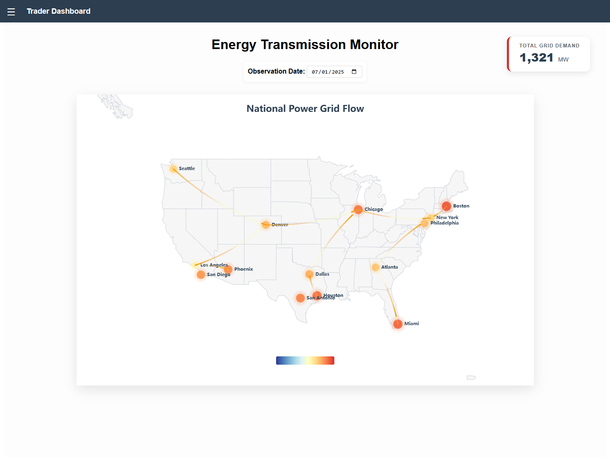
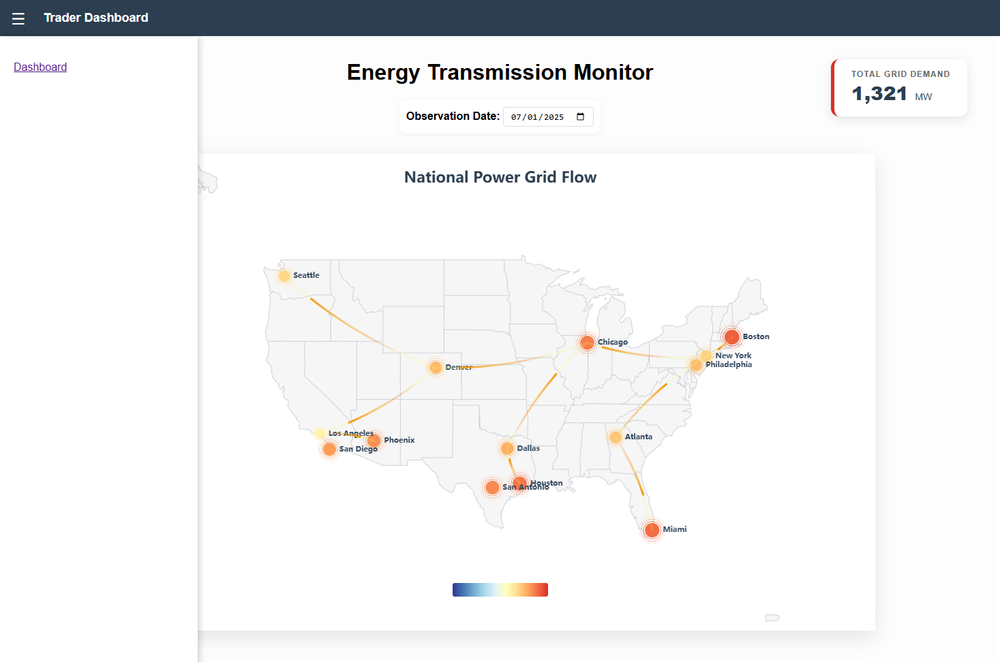

# ⚡ Interactive US Electricity Demand Map DEMO static data

A Vue 3 + Vite application featuring an interactive ECharts map. This dashboard visualizes city-level electricity demand across the United States with real-time data simulation and grid transmission lines.


## 🛠 Prerequisites

Before you begin, ensure you have the following installed:
* **Node.js**: Version 18.0 or higher (Check with `node -v`)
* **npm**: Usually comes with Node (Check with `npm -v`)
* **Git**: To clone the repository

## 🚀 Getting Started

### 1. Clone the Repository
```bash
git clone [https://github.com/BlitzDampfwalze/vue-app-demo.git](https://github.com/BlitzDampfwalze/vue-app-demo.git)
cd vue-app-demo
```
### 2. Install Dependencies
This will install Vue, ECharts, Vite, and other necessary packages.
```bash
npm install
```
### 3. Run the Development Server
```bash
npm run dev
```
